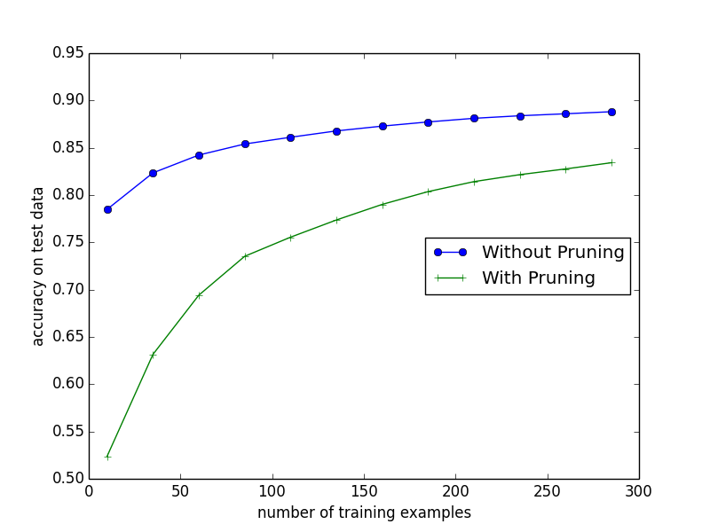

# DecisionTreeWithPruning
### Python implementation of decision tree with reduced error pruning
### The image below shows the learning curve of the classifier with and without pruning using training sets of size between 10 and 300

